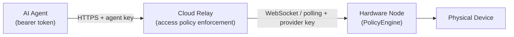

OAHL connects software agents to physical hardware across a three-tier trust chain: **agent → cloud relay → hardware node**. Security controls are applied at each layer to ensure only authorized agents can discover and operate devices.

## Trust chain

1. **Agent → Cloud:** The agent presents an `Authorization: Bearer <agent_api_key>` header on every request. The cloud validates the key against Redis and enforces the device access policy for the calling agent.
2. **Cloud → Node:** The local node authenticates to the cloud using a separate `provider_api_key`. These two key spaces are strictly distinct — an agent key cannot be used as a provider key, and vice versa.
3. **Node → Device:** Before any adapter execution, the local `PolicyEngine` checks the per-device `allowedCapabilities` and `disabledCapabilities` lists. Capabilities not on the allow-list (when a list is configured) or explicitly disabled are rejected before any hardware interaction occurs.

## Implemented controls

### Bearer token authentication

All agent-facing cloud endpoints require `Authorization: Bearer <agent_api_key>`. Provider-facing endpoints (`/v1/provider/*`) require a separate `provider_api_key`. Keys are provisioned through the developer portal (`/v1/portal/agents`) and validated against Redis on every request.

### Device access policy enforcement

Each registered device carries an `access_policy` object with a `visibility` mode and optional allow/deny lists. The cloud enforces this policy on every `GET /v1/capabilities` discovery call and `POST /v1/requests` session reservation. Agents that do not satisfy the policy receive HTTP 403. See [Access Policies](/security/access-policies) for the full reference.

### Session exclusivity

The `SessionManager` enforces that each physical device can hold at most one active session at a time. Concurrent reservation attempts from different agents are rejected. This prevents two agents from simultaneously operating the same piece of hardware.

### Policy Engine (local node)

The `PolicyEngine` in `@oahl/core` enforces per-device capability restrictions on the local node before any adapter execution. Hardware owners configure `allowedCapabilities` and `disabledCapabilities` per device in `oahl-config.json`. A capability blocked at this layer cannot be invoked even if the cloud access policy permits the agent.

### Docker sandboxing

Running the OAHL node server inside Docker provides OS-level isolation from the host. Only the explicitly mapped hardware devices (via the `devices` key in `docker-compose.yml`) are accessible inside the container.

### Network isolation recommendation

The local node server should run on an isolated network and not be exposed directly to the public internet. All agent traffic flows through the cloud relay over an outbound connection from the node — agents never connect to the node directly. If you need remote access to the node management interface, use a VPN or authentication proxy.

## Security control status

| Control | Layer | Status |
|---|---|---|
| Bearer token authentication (agent key) | Cloud | Implemented |
| Bearer token authentication (provider key) | Cloud | Implemented |
| Device access policy (visibility, allow/deny lists) | Cloud | Implemented |
| Session exclusivity (one agent per device) | Cloud | Implemented |
| Policy Engine (capability allow/deny per device) | Node | Implemented |
| Docker sandboxing | Node | Implemented |
| Network isolation | Infrastructure | Recommendation only |
| Signed JWT / mTLS agent identity verification | Cloud | Planned (Phase 4) |
| Replay protection / nonces | Cloud | Planned (Phase 4) |
| Per-agent rate limiting (HTTP 429) | Cloud | Planned (Phase 4) |
| Node attestation | Cloud | Planned (Phase 4) |
| Cloud-side JSON Schema validation of `params` | Cloud | Planned (Phase 4) |
| Portal PIN hashing (bcrypt / Argon2) | Cloud | Planned |

<Warning>
Several controls listed as "Planned" are not yet implemented. Production deployments should apply compensating controls. See [Known Security Gaps](/security/known-gaps) for specifics on each gap, the risk, and the recommended compensating control.
</Warning>

## Explore further

<CardGroup cols={2}>
  <Card title="Access Policies" icon="shield" href="/security/access-policies">
    Full reference for device visibility modes, allow/deny lists, and the local node Policy Engine.
  </Card>
  <Card title="Known Security Gaps" icon="triangle-exclamation" href="/security/known-gaps">
    Transparent disclosure of unimplemented controls, risks, and compensating measures.
  </Card>
</CardGroup>
